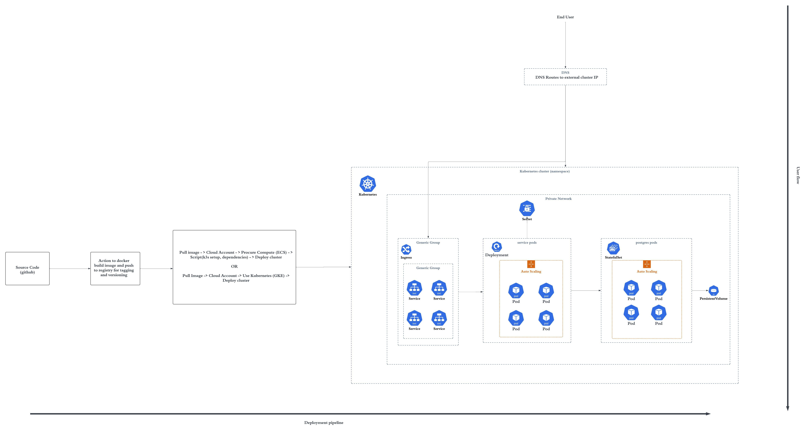

# Answers-AI backend task (Minimal LLM backend) 

> Task Reference: https://answersai.notion.site/AnswersAi-Backend-Technical-Assessment-22342a93b79c438badf7018d3284eb22

> Deployed API link: https://llm-service-q1p2.onrender.com

Initial requests might timeout as new instance starts which might take some time (~1-2 min).

You can first register user, then login and then ask questions for user. You can additionally fetch user and question details with the api. 


---


## Implementation 

This is a simple express backend to answer user questions using langchain and anthropic. The source code is modular which makes it scalable as needed. I have implemented it as below:
- I have integrated session based authentication using JWTs and `x-access-token` header. 
- I have defined two data models for User and Question as it seemed sufficient to me as per the problem statement. Service routes and controllers are also defined as per models for separation of concerns and modularity of the source code. There is a separated controller for `auth`.
- Clients module contains third party integrations which for now is just langchain for the service.
- I have created a middleware `verify-token` for JWT based session management which is in middlewares module.
- Lib module contains other general purpose functions which comprises here of a Responder which is for handling responses.


### Models

- `User` model
  ```
  id (pk, autogenerated UUID)
  name (user name, notnull)
  email (user email, unique and notnull)
  encryptedPassword (hashed password, notnull)
  ```

- `Question` model
  ```
  id (pk, autogenerated UUID)
  que (user question, notnull)
  generatedAnswer (generated answer, notnull)
  userId (foreign key for user id)
  ```


---


## Running service locally

First you need to clone the repo to get source on your local machine. Then follow either of the below steps to get the service up:

1.  Using npm
    - Define following env vars in a .env at the rootDir of source
      ```
      JWT_SECRET
      ANTHROPIC_API_KEY 
      PORT (optional, defaults to 3000)
      DB_CONN_STRING (valid DSN url for a postgreSQL db)
      ```
    - Run `npm install` to install dependency packages
    - Run `npm run start:dev` to run the express server
    Service would be live at `http://localhost:$PORT`

2.  Using docker
    - Define following env vars in a .env at the rootDir of source
      ```
      JWT_SECRET
      ANTHROPIC_API_KEY 
      PORT (optional, defaults to 3000)
      DB_CONN_STRING (valid DSN url for a postgreSQL db)
      ```
      Or, you can define these variables in context of your shell and read these through your dockerfile using `ENV` with some modifications
    - Run `docker build -f Dockerfile -t 'image_name:tag' .` to build the container image
    - Run `docker run -it -p HPORT:CPORT 'image_name:tag'` to spin up a running container for the image with provided tag
      HPORT: host port (your local machine port to be mapped to service)
      CPORT: container port (port at which your service is exposed in container, defaults to 3000 in this case without `$PORT`)
    Service would be live at `http://localhost:HPORT`


---


## APIs (swagger generated)

You can generate OPENAPI definitions for API routes of service using `npm run gen-swagger`.
> 
```
{
  "swagger": "2.0",
  "info": {
    "version": "1.0.0",
    "title": "REST API",
    "description": ""
  },
  "host": "localhost:3000",
  "basePath": "/",
  "schemes": [
    "http"
  ],
  "paths": {
    "/api/questions/": {
      "post": {
        "description": "",
        "parameters": [
          {
            "name": "body",
            "in": "body",
            "schema": {
              "type": "object",
              "properties": {
                "question": {
                  "example": "any"
                }
              }
            }
          }
        ],
        "responses": {
          "default": {
            "description": ""
          }
        }
      }
    },
    "/api/questions/{questionId}": {
      "get": {
        "description": "",
        "parameters": [
          {
            "name": "questionId",
            "in": "path",
            "required": true,
            "type": "string"
          }
        ],
        "responses": {
          "default": {
            "description": ""
          }
        }
      }
    },
    "/api/users/": {
      "post": {
        "description": "",
        "responses": {
          "default": {
            "description": ""
          }
        }
      }
    },
    "/api/users/{userId}": {
      "get": {
        "description": "",
        "parameters": [
          {
            "name": "userId",
            "in": "path",
            "required": true,
            "type": "string"
          }
        ],
        "responses": {
          "default": {
            "description": ""
          }
        }
      }
    },
    "/api/users/{userId}/questions": {
      "get": {
        "description": "",
        "parameters": [
          {
            "name": "userId",
            "in": "path",
            "required": true,
            "type": "string"
          }
        ],
        "responses": {
          "default": {
            "description": ""
          }
        }
      }
    },
    "/api/auth/login": {
      "post": {
        "description": "",
        "parameters": [
          {
            "name": "body",
            "in": "body",
            "schema": {
              "type": "object",
              "properties": {
                "email": {
                  "example": "any"
                },
                "password": {
                  "example": "any"
                }
              }
            }
          }
        ],
        "responses": {
          "default": {
            "description": ""
          }
        }
      }
    },
    "/api/auth/logout": {
      "post": {
        "description": "",
        "responses": {
          "default": {
            "description": ""
          }
        }
      }
    },
    "/api/auth/refresh": {
      "post": {
        "description": "",
        "parameters": [
          {
            "name": "body",
            "in": "body",
            "schema": {
              "type": "object",
              "properties": {
                "email": {
                  "example": "any"
                },
                "password": {
                  "example": "any"
                }
              }
            }
          }
        ],
        "responses": {
          "default": {
            "description": ""
          }
        }
      }
    }
  }
}
```

---


## Deployment


This service can be deployed as a dockerized container anywhere. Further, I have deployed it on render using blueprint `render.yaml` which is similar to kubernetes resource definitions which encloses both the service and database definitions. 

> Deployed API link: https://llm-service-q1p2.onrender.com

### Infrastructure and deployment for production scenarios

For production scenarios, cloud native deployment is a very good and scalable choice. Using kubernetes and resource definitions, one can deploy service and db along with a load balancer. Two possible ways can be used for this approach:

1. k3s based
   With a compute engine such as on-prem machine or cloud compute (for example, AWS ECS), one can setup k3s which is a very lightweight version of k8s and then deploy the resource definitions in a spinned up cluster.

2. cloud kubernetes engines
   Using a cloud kubernetes engine such as GKE, one can deploy resource definitions directly and cluster can be configured manually or programmatically through other IAC(Infra as code) approaches

#### Possible architecture for service along with CI/CD


---

## Resume for reference
> Link: https://bit.ly/resvats
